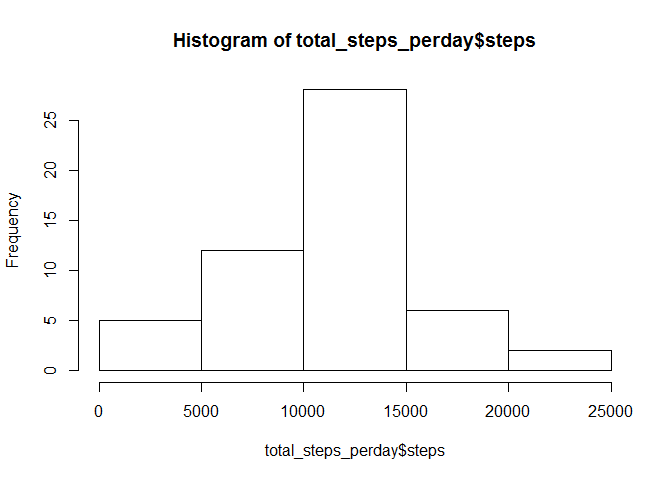
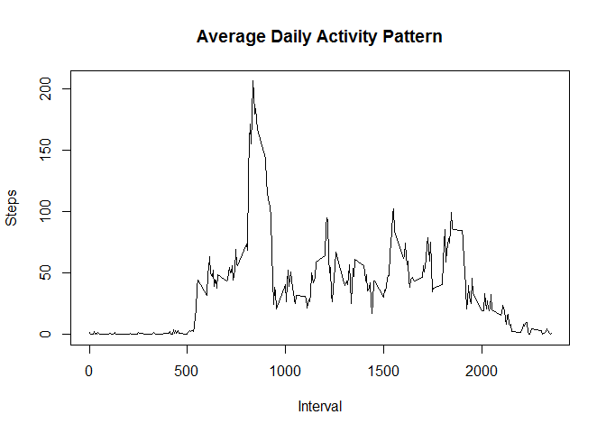
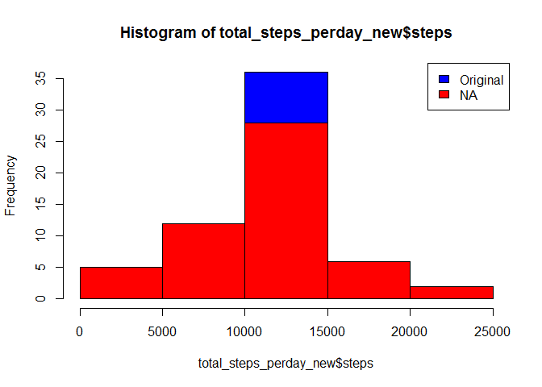
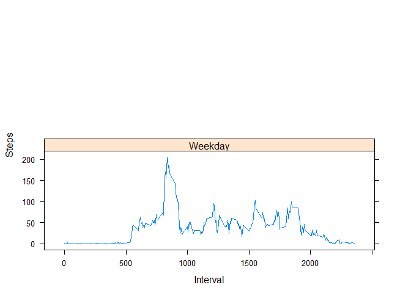

# Reproducible Research: Peer Assessment 1


## Loading and preprocessing the data

Let's download the dataset

```r
library("dplyr")
```

```
## 
## Attaching package: 'dplyr'
```

```
## The following objects are masked from 'package:stats':
## 
##     filter, lag
```

```
## The following objects are masked from 'package:base':
## 
##     intersect, setdiff, setequal, union
```

```r
library("lattice")
url <- "https://d396qusza40orc.cloudfront.net/repdata%2Fdata%2Factivity.zip"
f <- file.path(getwd(), "dataset.zip")
download.file(url, f)
unzip(f)

data_steps <- read.csv("activity.csv")
```
## What is mean total number of steps taken per day?
Aggregate steps per day

```r
total_steps_perday <- aggregate(data_steps[c("steps")], list(Year = data_steps$date), sum)

#draw histogram
hist(total_steps_perday$steps)
```

<!-- -->

```r
#print mean and median
mean_steps_perday <- mean(total_steps_perday$steps, na.rm = TRUE)
print(mean_steps_perday)
```

```
## [1] 10766.19
```

```r
median_steps_perday <- median(total_steps_perday$steps, na.rm = TRUE)
print(median_steps_perday)
```

```
## [1] 10765
```

## What is the average daily activity pattern?

```r
#------ What is the average daily activity pattern? -------
average_daily_activity <- aggregate(list(steps = data_steps$steps), list(interval = data_steps$interval), mean, na.rm = TRUE)

#plot time series
plot(average_daily_activity$interval, 
     average_daily_activity$steps, 
     type = "l", 
     main = "Average Daily Activity Pattern",
     xlab = "Interval", 
     ylab = "Steps")
```

<!-- -->

```r
#interval that has the maximum number of steps
interval_maxsteps_value <- max(average_daily_activity$steps)
interval_maxsteps <- average_daily_activity[average_daily_activity$steps == interval_maxsteps_value, ]
print(interval_maxsteps)
```

```
##     interval    steps
## 104      835 206.1698
```
## Imputing missing values

```r
#total number of missing values
num_missing_values <- sum(is.na(data_steps$steps))
print(num_missing_values)
```

```
## [1] 2304
```

```r
#replace NAs
missing_values <- is.na(data_steps$steps)
data_steps_woNA <- subset(data_steps, !is.na(data_steps$steps))
#average_perinterval <- aggregate(list(steps = data_steps_woNA$steps), list(interval = data_steps_woNA$interval), mean, na.rm = TRUE)
average_perinterval <- tapply(data_steps_woNA$steps, data_steps_woNA$interval, mean, na.rm = TRUE, simplify = T)
data_steps_new <- data_steps
data_steps_new$steps[missing_values] <- average_perinterval[as.character(data_steps_new$interval[missing_values])]
#aggregate steps per day
total_steps_perday_new <- aggregate(data_steps_new[c("steps")], list(Year = data_steps_new$date), sum)

#draw histogram
hist(total_steps_perday_new$steps, col = "blue")
hist(total_steps_perday$steps, col = "red", add = TRUE)
legend("topright", c("Original","NA"), fill = c("blue","red"))
```

<!-- -->

```r
#print mean and median
mean_steps_perday_new <- mean(total_steps_perday_new$steps, na.rm = TRUE)
print(mean_steps_perday_new)
```

```
## [1] 10766.19
```

```r
median_steps_perday_new <- median(total_steps_perday_new$steps, na.rm = TRUE)
print(median_steps_perday_new)
```

```
## [1] 10766.19
```


## Are there differences in activity patterns between weekdays and weekends?

```r
data_steps$date <- as.Date(data_steps$date)
data_steps$weekday <- weekdays(data_steps$date)
data_steps <- data_steps %>%
    mutate(weekdaytype = ifelse(weekday == c("sáb","dom"), "Weekend", "Weekday"))

average_daily_activity_weekdaytype <- aggregate(list(steps = data_steps$steps), list(interval = data_steps$interval, weekdaytype = data_steps$weekdaytype), mean, na.rm = TRUE)

#plot time series
xyplot(steps ~interval | weekdaytype,
       layout = c(1,2),
       xlab = "Interval",
       ylab = "Steps",
       type = "l",
       lty = 1,
       data = average_daily_activity_weekdaytype)
```

<!-- -->
